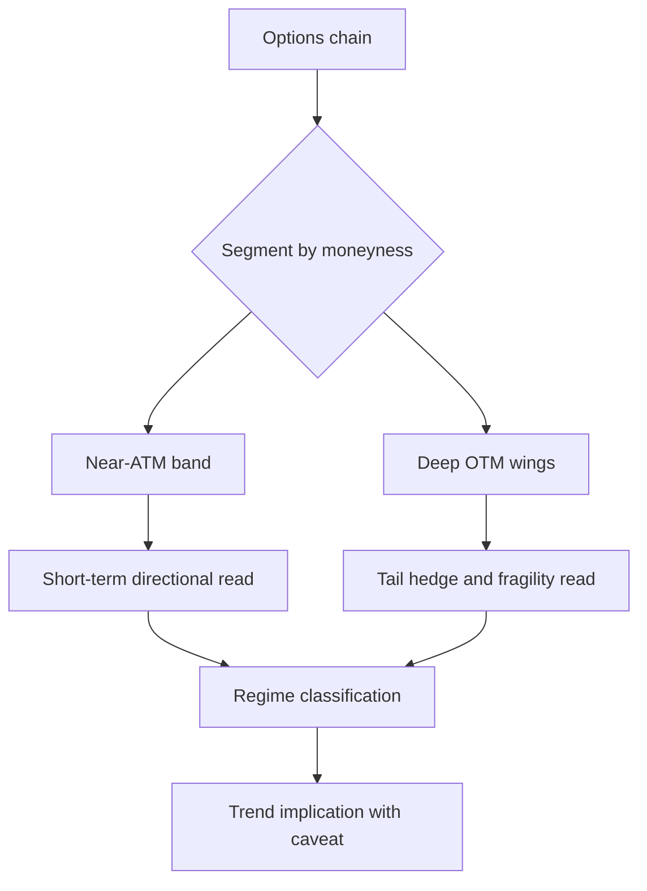

# fix: Segment put/call readings by moneyness

## Summary

Correct the `options-market-structure` skill so it does not treat full-chain `put/call` open interest as a direct short-term direction signal. The update will make moneyness segmentation a first-class rule: near-ATM positioning drives next-expiry directional reads, while deep OTM put concentration is treated primarily as tail-risk insurance unless supporting evidence says otherwise.

---

## Problem Frame

The v1 toolkit correctly warns that `put/call` is not a magic contrarian trigger, but it still leaves room for an analyst to over-weight aggregate `put/call OI`. The MU/SNDK review exposed the failure mode: full-chain `P/C OI` looked bearish because deep OTM put inventory dominated the chain, while `ATM +/- 10% P/C OI` showed near-term bullish positioning.

This is not a new product direction. It is a correction to the interpretation layer required by the original goals: translate options-market structure into usable trend context while downgrading weak or misleading inferences.

---

## Requirements

| ID | Requirement | Trace |
|---|---|---|
| R1 | The skill must separate directional `put/call` reads from tail-hedge inventory reads. | Extends origin R1, R2, R3 |
| R2 | The workflow must require a near-ATM moneyness band for short-dated trend inference. | Extends origin AE1, AE2 |
| R3 | The reference must document when high aggregate `put/call OI` is misleading because deep OTM puts dominate the chain. | Extends origin R3 |
| R4 | The output template must show both `Directional P/C` and `Tail Hedge / Wing OI` instead of one undifferentiated `Put/Call` row. | Extends origin R1, R2 |
| R5 | Worked examples must include a case where full-chain `P/C OI` is bearish-looking but near-ATM positioning is bullish. | Extends origin R4 |
| R6 | The repo and installed Hermes copy must not drift after the documentation update. | Extends origin R5 |

---

## Key Technical Decisions

- KTD1. **Use near-ATM OI for short-term direction:** For next-expiry trend reads, the default directional lens should be `ATM +/- 10% P/C OI`, with the band adjustable when price, volatility, or contract spacing makes 10% unsuitable. This prevents stale or insurance-driven wing inventory from controlling the direction call.
- KTD2. **Treat deep OTM puts as risk posture first:** Deep OTM put concentration should feed the fragility, skew, and crash-protection read before it feeds the direction read. It becomes directionally bearish only when paired with nearer-dated put demand, rising IV, downside skew, or price weakness.
- KTD3. **Preserve the six-check framework but refine the first check:** The framework remains recognizable, but `Put/Call Positioning` becomes a two-layer check: directional zone and tail zone. This keeps the v1 structure stable while fixing the analysis failure.
- KTD4. **Use markdown-only updates:** The repo is a document-first skill collection. No scripts, data feed integration, or automated chain parser should be introduced for this correction.

---

## High-Level Technical Design

The updated framework should force the analyst through this split before naming a regime. A high full-chain `P/C OI` can still matter, but only after asking where that put OI sits.

---

## Implementation Units

### U1. Refine the flagship workflow and output template

**Goal:** Make moneyness segmentation visible in the primary skill entrypoint so future analyses do not collapse full-chain `put/call` into a single direction signal.

**Requirements:** R1, R2, R4

**Dependencies:** None

**Files:** `skills/options-market-structure/SKILL.md`

**Approach:** Rename or expand the first check from generic `Put/Call Positioning` into a split read: near-ATM directional positioning and deep-wing tail protection. Update the practical workflow so the analyst identifies the expiry, defines the moneyness band, checks whether full-chain OI is distorted by far OTM inventory, and only then assigns a regime. Update the output template to include rows for `Directional P/C`, `Tail Hedge / Wing OI`, and `Full-Chain P/C Caveat`.

**Patterns to follow:** `skills/options-market-structure/SKILL.md`, `skills/pb-semiconductor/SKILL.md`

**Test scenarios:**
- Happy path: when `ATM +/- 10% P/C OI` is low and deep OTM put OI is high, the template supports a cautiously bullish short-term read with explicit tail-protection caveat.
- Edge case: when aggregate `P/C OI` is high but concentrated far below spot, the skill does not label the setup bearish solely from the aggregate value.
- Error path: when the analyst lacks strike-level OI by moneyness, the skill downgrades confidence and avoids a strong directional conclusion.
- Integration scenario: the updated workflow still ends in one of the existing regime names rather than creating a parallel classification system.

**Verification:** A reader can no longer complete the primary workflow using only full-chain `put/call OI` for direction.

### U2. Add the moneyness segmentation rules to the reference layer

**Goal:** Document the methodology behind separating directional demand from crash-protection inventory.

**Requirements:** R1, R2, R3

**Dependencies:** U1

**Files:** `skills/options-market-structure/REFERENCE.md`

**Approach:** Expand the `Put/Call Ratio` section into three explicit lenses: near-ATM directional zone, full-chain aggregate, and deep OTM wing inventory. Add interpretation rules for each lens, including how to treat stale OI, institutional tail hedges, and cases where wing inventory should still matter through skew or fragility. Add the MU/SNDK-style failure mode to `Common Mistakes`.

**Patterns to follow:** `skills/options-market-structure/REFERENCE.md`, `skills/pb-semiconductor/REFERENCE.md`

**Test scenarios:**
- Happy path: a reader sees low near-ATM `P/C OI` and high full-chain `P/C OI` and correctly interprets the setup as short-term bullish but hedged.
- Edge case: a deep OTM put wall close enough to spot after a sharp selloff is not automatically dismissed as stale insurance.
- Error path: when only aggregate `put/call` is available, the reference instructs the analyst to lower confidence rather than infer direction.
- Integration scenario: the data-confidence ladder distinguishes basic aggregate data from strike-level moneyness segmentation.

**Verification:** The reference explains why "high `P/C OI` means bearish" is invalid without strike-distance context.

### U3. Add a worked correction example

**Goal:** Make the corrected read operational through a concrete example that mirrors the MU/SNDK review pattern.

**Requirements:** R5

**Dependencies:** U1, U2

**Files:** `skills/options-market-structure/EXAMPLES.md`

**Approach:** Add an example where full-chain `P/C OI` is above 1.0, near-ATM `P/C OI` is below 1.0, and most put OI sits in deep OTM strikes. The example should show two-layer interpretation: short-term direction is bullish or cautiously bullish, while tail-risk protection and high IV make the regime fragile rather than clean. Keep the example symbol-agnostic or label it as a pattern example so the doc does not depend on stale market data.

**Patterns to follow:** Existing examples in `skills/options-market-structure/EXAMPLES.md`

**Test scenarios:**
- Happy path: the example demonstrates why the near-ATM band drives the next-week directional read.
- Edge case: the example preserves the warning that tail hedging still matters for fragility even when it is not bearish directionally.
- Integration scenario: the example maps the observations into an existing regime such as `Fragile Melt-Up`, `Squeeze Risk`, or `Mixed / Conflicted`.

**Verification:** A future agent can use the example as a template and avoid repeating the MU/SNDK aggregate `P/C OI` mistake.

### U4. Update discovery and installed Hermes copy

**Goal:** Keep the repo entrypoint and local Hermes install aligned after the skill correction.

**Requirements:** R6

**Dependencies:** U1, U2, U3

**Files:** `README.md`

**Approach:** Update README language only if the skill summary needs to mention moneyness-aware `put/call` interpretation. After repo files are updated, sync the full `skills/options-market-structure/` folder into the local Hermes skill namespace so Hermes uses the corrected framework.

**Patterns to follow:** `README.md`, existing Hermes local install layout for the `semiconductor-fn-analysis` skill namespace.

**Test scenarios:**
- Happy path: `hermes skills list` still shows `options-market-structure` as enabled after the local copy is refreshed.
- Integration scenario: the Hermes-installed files match the repo skill files after sync.
- Test expectation: none -- documentation and local skill-copy synchronization, verified by file comparison and Hermes skill listing.

**Verification:** The repo and Hermes installed copy expose the same corrected methodology.

---

## Scope Boundaries

### In Scope

- Methodology correction for `put/call` interpretation by moneyness.
- Updates to the skill entrypoint, reference, examples, and minimal README discovery language if needed.
- Refreshing the local Hermes-installed copy after repo edits.

### Deferred to Follow-Up Work

- A structured worksheet that calculates near-ATM and wing `P/C OI` fields.
- A script or notebook that pulls option chains and buckets OI by moneyness.
- A semiconductor-only companion layer for memory-stock option structures.

### Outside This Product's Identity

- Options trade recommendations.
- Broker execution or alerting.
- Premium-data dealer-position claims.

---

## Risks & Dependencies

- **Band rigidity:** A fixed `ATM +/- 10%` rule can be too wide for low-vol names and too narrow for high-vol names. The docs should present it as a default heuristic, not a universal law.
- **False dismissal of puts:** Deep OTM puts are often insurance, but not always irrelevant. The reference must preserve their role in skew, fragility, and crash-risk interpretation.
- **Data availability:** Some free sources expose aggregate ratios more easily than strike-level OI. The data-confidence ladder should tell the analyst to reduce confidence when moneyness segmentation is unavailable.
- **Hermes drift:** The repo copy and local Hermes-installed copy can diverge unless the implementation explicitly syncs the installed skill after edits.

---

## Sources & Research

- `docs/brainstorms/2026-06-13-options-market-structure-toolkit-requirements.md`
- `docs/plans/2026-06-13-001-feat-options-market-structure-toolkit-plan.md`
- `skills/options-market-structure/SKILL.md`
- `skills/options-market-structure/REFERENCE.md`
- `skills/options-market-structure/EXAMPLES.md`
- User/Hermes review of MU and SNDK showing full-chain `P/C OI` divergence from `ATM +/- 10% P/C OI`.
